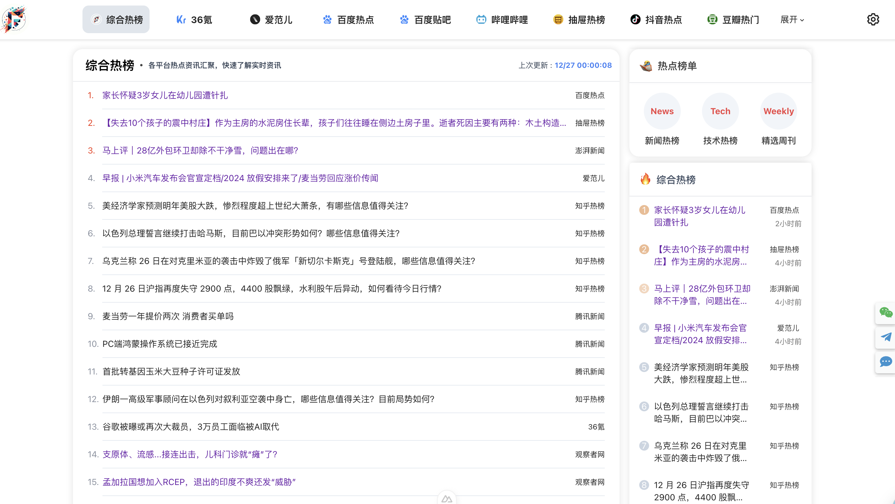

## 项目介绍

> 该项目主要用于承载 `FRE123` 热榜信息版块业务，持续更新优化中...
> 主要技术栈有: `Nuxt3` + `VUE3` + `TailwindCSS` + `Typescript` 


## 快速启动

本项目使用 `node v18.16.0` 版本环境 `yarn`作为包管理工具

### 克隆项目
```
git clone https://github.com/fre123-com/fre123-info-flow.git
```

### 安装依赖
```
cd fre123-info-flow
yarn install
```

### 环境配置
打开根目录下面 .env 文件，里面包含了 3 个配置项
```
  NUXT_BACKEND_API=后端服务API
  NUXT_APP_ID=项目标识，默认fre123
  NUXT_APP_TOKEN=请求凭证
```

### 启动项目
配置好环境变量之后，直接运行 `yarn dev` 即可


## 运行
启动成功后，直接访问 http://localhost:3000 即可看到页面如下图所示

